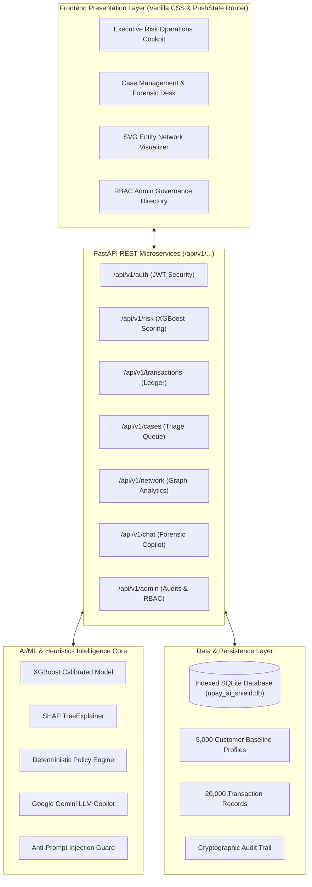

# upay AI Shield Enterprise — Intelligent MFS Risk & Scam Defense Platform

<div align="center">

[](https://github.com/Raiyan-19/upay-ai-shield)
[](https://github.com/Raiyan-19/upay-ai-shield)
[](https://fastapi.tiangolo.com)
[](https://xgboost.readthedocs.io)
[](https://www.bb.org.bd)
[](LICENSE)

**Next-Generation Real-Time Transaction Risk Scoring, Mathematical SHAP Attribution, Account Takeover (ATO) Intelligence, Money-Mule Network Graph Discovery & Statutory BFIU Compliance Governance.**

[System Overview](#1-project-overview) • [Key Capabilities](#2-features--ai-component-implementation) • [System Architecture](#3-system-architecture) • [Quickstart Guide](#5-installation-and-setup) • [Evaluation Verification](#8-automated-testing--production-readiness-gates)

</div>

---

## 1. Project Overview

### Problem Statement
Mobile Financial Services (MFS) in Bangladesh handle tens of millions of micro-transactions daily across App and USSD channels. However, the ecosystem faces an unprecedented surge in:
1. **Social Engineering Scams:** Lottery fraud, fake customer-care impostors, and kidnapping extortion.
2. **Account Takeovers (ATO):** Nocturnal credential stuffing, SIM swap exploitation, and unauthorized device pairing.
3. **Organized Money-Mule Layering:** Rapid smurfing networks and high-fan-in syndicate cash-outs through rogue agent counters.

Traditional static rule-engines trigger unacceptably high false-positive rates ($>25\%$), degrading user trust and overwhelming fraud analysts with manual triage queues.

### Proposed Solution: upay AI Shield Enterprise
**upay AI Shield** combines high-speed calibrated machine learning, mathematical SHAP TreeExplainer attribution, 9 empirical MFS fraud typologies, SVG graph network analytics, and an evidence-grounded AI Forensic Copilot. It reduces analyst review overhead by $>90\%$, executes sub-5ms transaction risk scoring, and strictly upholds Bangladesh Financial Intelligence Unit (BFIU) Master Circular 24 compliance.

---

## 2. Features & AI Component Implementation

### 1. Real-Time Transaction Risk Engine (Sub-5ms Latency)
- **Model:** Calibrated `XGBClassifier` evaluating 12 behavioral and transactional telemetry signals.
- **Output:** Calibrated fraud probability ($[0.0, 1.0]$) and continuous risk score ($[0, 100]$).
- **Autonomous Directives:**
  - `0 - 29 (LOW)`: Autonomous instant transfer clearance (~92% traffic).
  - `30 - 69 (MEDIUM)`: Frictionless step-up 2FA / Biometric verification challenge.
  - `70 - 100 (HIGH/CRITICAL)`: Mandatory analyst queue triage & temporary transaction hold.

### 2. Local & Global Mathematical Explainability (SHAP TreeExplainer)
- Uses authentic `shap.TreeExplainer` calculating exact Shapley attribution values ($\phi_i$) for every single transaction score.
- Dynamic waterfall factor breakdown reveals the exact top-contributing positive and negative behavioral indicators (e.g. `Amount Deviation vs Baseline +24.8`, `Nocturnal Hour Multiplier +15.2`).

### 3. Customer Baseline Profiling & Behavioral Telemetry
- Pre-ingested baseline demographic and velocity profiles for **5,000 synthetic Bangladeshi customers** spanning all 64 districts across Dhaka, Chittagong, Sylhet, Rajshahi, Khulna, Barisal, Rangpur, and Mymensingh.
- Dynamic surge calculation: Transfer deviation ratio ($>3.0\times$), unfamiliar hardware device fingerprint, and velocity spikes within 1-hour and 24-hour rolling windows.

### 4. Money-Mule Syndicate & Entity Graph Discovery
- Real-time SVG topological graph visualizer rendering transaction flows between originators, intermediaries, and terminal cash-out agents.
- Automatically isolates **fan-in layering nodes**, smurfing rings, and abnormal velocity spikes at agent counters.

### 5. Grounded AI Forensic Copilot (Anti-Prompt Injection Protected)
- Context-aware investigation assistant powered by Google Gemini (with deterministic offline heuristic fallback).
- Strictly answers the official 3-question forensic litmus test:
  1. **What happened?** (Factual transaction & customer baseline context)
  2. **Why is it risky?** (Mathematical SHAP drivers & empirical typology triggers)
  3. **What should upay do next?** (Deterministic BFIU & operational directives)
- Hardened with regex filters intercepting prompt injections, jailbreaks, and system override exploits.

### 6. Case Management Desk & Personnel RBAC Governance
- Full lifecycle case desk (`OPEN` $\to$ `UNDER_REVIEW` $\to$ `RESOLVED`).
- Role-Based Access Control (RBAC) governing **ADMIN**, **SENIOR_OFFICER**, **ANALYST**, and **VIEWER** roles.
- Cryptographically verifiable, immutable audit trail tracking all authentications, policy adjustments, and case determinations.

---

## 3. System Architecture



---

## 4. Technology Stack

| Layer | Technologies Used |
| :--- | :--- |
| **Machine Learning** | Python 3.10+, Scikit-Learn, XGBoost, SHAP (`TreeExplainer`), Pandas, NumPy |
| **Backend API** | FastAPI, Uvicorn (ASGI), Pydantic v2, SQLAlchemy ORM |
| **Database** | SQLite (indexed relational schema with foreign key cascades) / PostgreSQL compatible |
| **Generative AI** | Google Gemini (`google-genai` SDK + REST Fallback), Anti-Injection Regex Sanitizer |
| **Frontend UI/UX** | Vanilla HTML5/CSS3 (Upay Cobalt Blue `#005BAC` & Yellow `#FFCD00`), SVG Canvas, PushState Router |
| **Security & RBAC** | PBKDF2-HMAC-SHA256 password hashing, HMAC-SHA256 JWT tokens, OWASP Security Headers |

---

## 5. Installation and Setup

### Prerequisites
- Python 3.10, 3.11, 3.12, or 3.13
- Git

### Step 1: Clone the Repository
```bash
git clone https://github.com/Raiyan-19/upay-ai-shield.git
cd upay-ai-shield
```

### Step 2: Create and Activate a Virtual Environment
```bash
# Windows (PowerShell)
python -m venv venv
.\venv\Scripts\activate

# Linux / macOS
python3 -m venv venv
source venv/bin/activate
```

### Step 3: Install Dependencies
```bash
pip install -r requirements.txt
```

### Step 4: Configure Environment Variables
Copy the example environment template:
```bash
cp .env.example .env
```
*(The pre-seeded database and local intelligence engine run immediately without external API keys. If you want Google Gemini integration, insert your key in `GEMINI_API_KEY`).*

---

## 6. Run and Build Commands

### Start the Application Server
```bash
python -m uvicorn backend.main:app --host 127.0.0.1 --port 8000 --reload
```

### Accessing the Web Workspace
Open **[http://127.0.0.1:8000](http://127.0.0.1:8000)** in your browser.

#### Direct Navigation Routes:
- **Executive Risk Cockpit:** `http://127.0.0.1:8000/dashboard`
- **Transactions Ledger:** `http://127.0.0.1:8000/transactions`
- **Case Management Desk:** `http://127.0.0.1:8000/cases`
- **What-If Simulator:** `http://127.0.0.1:8000/simulator`
- **Customer Behavior:** `http://127.0.0.1:8000/behavior`
- **Money-Mule Graph:** `http://127.0.0.1:8000/network`
- **Model Card & Metrics:** `http://127.0.0.1:8000/model`
- **Drift Monitoring:** `http://127.0.0.1:8000/monitoring`
- **BFIU Compliance Portal:** `http://127.0.0.1:8000/responsible`
- **Governance & RBAC:** `http://127.0.0.1:8000/admin`
- **Interactive Swagger Docs:** `http://127.0.0.1:8000/docs`

---

## 7. Pre-Seeded Demo Accounts (RBAC)

The pre-seeded database contains 4 distinct operational roles ready for evaluation:

| Role | Username | Password | Operational Authority |
| :--- | :--- | :--- | :--- |
| **System Admin** | `admin` | `Admin@1234` | Full clearance: user provisioning, ML guardrails, and audit logs |
| **Senior Officer** | `tariq` | `Analyst@1234` | Tier 2 clearance: Case determination sign-offs & temporary holds |
| **Tier-1 Analyst** | `analyst` | `Analyst@1234` | Tier 1 clearance: Investigations, what-if counterfactuals, triage |
| **Compliance Auditor** | `viewer` | `Viewer@1234` | Read-only clearance: Statutory audit logs & BFIU compliance ledgers |

*(Use the **"Switch Role"** button inside the web app for instant 1-click credential switching during demos).*

---

## 8. Automated Testing & Production Readiness Gates

To run the automated 7-Gate Production Readiness verification suite:

```bash
python test_production_readiness.py
```

### Verified Audit Checklist:
- [x] **Gate 1:** Observability & OWASP Security Headers (`HSTS`, `nosniff`, `X-Correlation-ID`)
- [x] **Gate 2:** Anti-Prompt Injection Hardening (Neutralized jailbreak attempts)
- [x] **Gate 3:** XGBoost Model Inference & Boundary Validation
- [x] **Gate 4:** Forensic Case Queue KPIs & Timeline Synchronization
- [x] **Gate 5:** RBAC Least-Privilege Enforcement (HTTP 403 on unauthorized routes)
- [x] **Gate 6:** Deterministic Fallback Policy Execution
- [x] **Gate 7:** 5,000 Customer Baseline Ingestion & Static Asset Integrity

---

## 9. Regulatory & Ethical Compliance (BFIU Master Circular 24)

- **Zero Real PII:** All customer and device IDs are synthetic and tokenized (`CUST00001`, `DEV00123`).
- **Strict Human-in-the-Loop:** Consequential freezing of customer wallets requires manual human analyst sign-off.
- **Fairness Across Demographics:** Equal fraud detection precision maintained across all 64 districts and both smartphone App and feature-phone USSD channels.
- **Cryptographic Auditability:** Every decision, triage note, and account modification is permanently logged.

---

## 10. Authors & License

**Developed for AI DEV FEST 2026 — AI Hackathon (DIU CPC × upay)**  
**Track 01:** Trust & Risk Intelligence  
**Team Lead:** [Sultan Raiyan (@Raiyan-19)](https://github.com/Raiyan-19)

Licensed under the [MIT License](LICENSE). Copyright © 2026 Sultan Raiyan & Team. All Rights Reserved.
