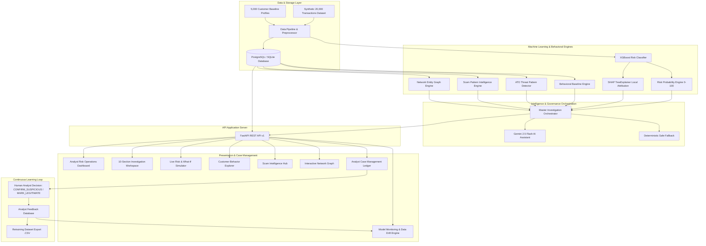

# System Architecture — upay AI Shield
**AI-Powered Transaction Risk & Scam Intelligence Platform**

---

## 1. High-Level Architectural Flow



---

## 2. Core Operational Pipeline

```
Transaction
    ↓
XGBoost Risk Model (0 - 100 Risk Score)
    ↓
Customer Behavior Baseline Comparison
    ↓
Scam Pattern Intelligence (9 Empirical Typologies)
    ↓
Account Takeover (ATO) Combinatorial Signals
    ↓
Network Entity Graph Analysis (Customer, Receiver, Device, Location)
    ↓
SHAP Explainability (Local Feature Attribution)
    ↓
Gemini 2.5 Flash Structured Brief (or Safe Deterministic Fallback)
    ↓
Analyst Case Management (OPEN → UNDER_REVIEW → RESOLVED)
    ↓
Human Reviewer Decision & Feedback Loop
    ↓
Model Monitoring, Data Drift Tracking & Retraining Dataset Export
```

---

## 3. Boundary & Truth Model

To maintain scientific integrity and regulatory compliance in financial risk management, **upay AI Shield** explicitly delineates component responsibilities:

| Component | Nature / Source | Authority & Guarantee |
| :--- | :--- | :--- |
| **Transaction Records & Profiles** | **Synthetic Dataset** (20,000 transactions, 5,000 customers modeled on Bangladesh MFS typologies) | Safe sandbox for validation. No real customer PII or real banking systems involved. |
| **Risk Score & Probability** | **Model-Generated** (Trained XGBoost Classifier) | Statistical estimate (0.00–100.00). High calibration across 12 behavioral/telemetry features. |
| **Risk Attribution (Points)** | **Mathematically Computed** (`shap.TreeExplainer`) | Exact local Shapley values calculating true directional impact on the log-odds prediction. |
| **Behavioral Baseline** | **Empirically Calculated** (Customer transaction history) | Real statistical means, standard deviations, activity windows, and distinct entity counts. |
| **Scam & ATO Indicators** | **Rule & Signal Engine** (Calculated from actual transaction telemetry) | Potential indicator evidence. Never declared as "confirmed fraud" without human review. |
| **Network Graph Relationships** | **Dataset-Derived Topology** | Real connected entity multi-hop graph showing shared devices, locations, and high-degree receivers. |
| **Investigation Narrative** | **Gemini Generative AI** (Strictly bounded by model evidence) | Structured JSON brief and Q&A. Never invents unprovided facts. Fails safe to deterministic fallback. |
| **Action & Account Decisions** | **Human Analyst Oversight** | **Consequential Authority**. AI only assists; human analysts make final freezing/clearing decisions. |
| **Model Drift Telemetry** | **Statistical NAMS Computation** | Normalized Mean Shift comparing recent transaction window against baseline training distribution. |

---

## 4. Key Architectural Guarantees

1. **Zero Hallucination Tolerance**:
   - The LLM receives only structured mathematical and behavioral evidence extracted by the backend.
   - The LLM prompt explicitly prohibits declaring confirmed fraud or autonomous freezing.
   - If Gemini is unreachable or rate-limited (e.g. 429), a **deterministic fallback generator** formats the identical JSON schema from live XGBoost, SHAP, and baseline data.

2. **Currency Standardization (BDT / ৳)**:
   - All financial amounts are stored as raw floating-point numbers in the database (e.g. `18500.00`).
   - The frontend, API responses, and narrative briefs format amounts exclusively as Bangladesh Taka (`৳18,500.00`).

3. **Active Learning Feedback Loop**:
   - Every analyst determination logs an audit event in `case_events` and records structured ground-truth into `analyst_feedback`.
   - Analysts can export verified cases via `POST /api/v1/feedback/export` to generate retraining datasets with original features, model scores, analyst decisions, and audit timestamps.
